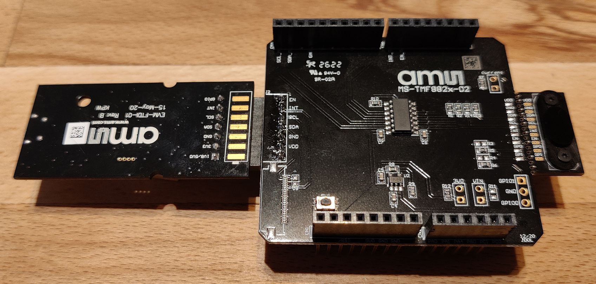

# TMF8828 (Time-of-flight) python driver and application programs

This TMF8828 python driver package is intended to show the capabilies of this time-of-flight device. 

## Requirements  

- an ams OSRAM EVM FTDI controllor board (with 7 pin connector) 
- an ams OSRAM TMF882x Arduino Shield Board (MS-TMF882x-01) [TMF882X MCU SHIELD EVM](https://ams-osram.com/products/boards-kits-accessories/kits/ams-tmf882x-evm-eb-shield-evaluation-kit)
- a micro USB cable
- any python version >= 3.6 for Windows 10 or Windows 11, 64bit version recommended
- all python packages listed in requirements.txt. To install the required packages, run `python -m pip install -r requirements.txt`.

As a second controller option the python sources can also use [FT2232H-56 Mini Modules](https://ftdichip.com/products/ft2232h-56-mini-module/)

To enable the FT2232H controller set 

```use_evm = False``` 

in the python source code.

ams OSRAM does not officially support these controllers. Please use at your own risk.

## Files  

Please see README.md for a quick overview of files in this release.

## Hardware Setup

### ams OSRAM EVM FTDI controller

 * place the Arduino Shield board in front of you , you should be able to read the "ams" company logo correctly
 * in that orientation the TMF882X sensor is on the right hand side of the board
 * on the left hand side you can find a row of seven lands labeled with "EN", "INT", "SCL", ...
 * solder a pin header with seven pins (angled at 90 degrees) into these lands
 * connect the EVM FTDI controller board to this pin header
 * please check the silk screen on the controller and on the shield board for correct controller orientation
 * the EVM controller should face downwards, you should see the ams logo on the back of the controller board
 * compare your setup with the one in this picture
 


  
### FT2232H-56 Mini Module

  * solder the pin header to the Arduino Shield board as described above
  * connect the mini module to pin header with e.g. breadboard cables according to the following table

Mini Module Pin | Shield Board Pin Header Pin
----------------|----------------------------
CN2-1 (GND)     | GND
CN2-2 (V3V3)    | VDD
CN2-8 (AD0)     | SCL
CN2-9 (AD1)     | SDA
CN2-10 (AD2)    | SDA (AD1 and AD2 need to be connected to this pin)
CN2-17 (AC0)    | EN
CN2-18 (AC1)    | INT

Please also refer to:

  * [Mini Module Data Sheet](https://ftdichip.com/wp-content/uploads/2021/02/DS_FT2232H-56Q_Mini_Module.pdf)
  * [FT2232H Data Sheet](https://ftdichip.com/wp-content/uploads/2020/07/DS_FT2232H.pdf)

## Examples

### Power up device  

*tmf882x/examples/example_tmf882x_device.py*

This example program establishes the communication to the TMF882x target via the selected FTDI device.

It disables the target (by pulling the ENABLE line to low), re-enables the device (ENABLE line high), reads and dumps the first 16 I2C registers and disables the target at the end.

### Power up device and do measurements  

*tmf882x/examples/example_tmf882x_app.py*

This example program demonstrates the most common functions of the TMF882x firmware. In detail:

* Open the communication
* Enable the device
* Download the sensor firmware
* Start the firmware
* Read the firmware application version
* Configure the application
* Start a measurement
* Read <n> results and write to CSV
* Stop a measurement
* Disable and close the device
* Read the error codes

### Power up device and do measurements with histogram readout

*tmf882x/examples/example_tmf882x_app_with_histograms.py*

This example program demonstrates measurements with histogram readout. In detail:

* Open the communication
* Enable the device
* Download the sensor firmware
* Start the firmware
* Read the firmware application version
* Configure the application for histogram readout
* Start a measurement
* Read <n> results and write to CSV
* Stop a measurement
* Disable and close the device
* Read the error codes

### I2C slave address change

*tmf882x/examples/example_tmf882x_i2c_address_change.py*

This example programs demonstrates that the host can reconfigure the TMF882x to alternative I2C addresses. In detail:

* Open the communication
* Enable the device
* Download the sensor firmware
* Start the firmware
* Change the I2C address to 0x6a via firmware commands

### Sensor Firmware Test

*tmf882x/test/test_tmf882x_app.py*

This is a comprehensive test program for the sensor firmware.

A single test runs these steps:

* run factory calibration
* read and store calibration data
* configure sensor (measurement iterations, measurement period)
* load factory calibration from stored data
* start target measurements and read 10 measurement data frame
* compare each measured distance (for each zone in the SPAD map) with the predefined thresholds
* check if any error has occured

These test steps are run:

* for the 3x3, 4x4 and 8x8 mode of the TMF8828
* for each SPAD map for the selected mode
* for the short range accuracy and long range accuracy setup of the firmware

### Factory calibration  

Factory calibration must be done for each device, for each SPAD map and for long and short range accuracy seperately. 
Use 4000K iterations for factory calibration (see datasheet section 7.3). 

The application will configure the tmf8828 for 4000K iterations, execute factory calibration and reconfigure the device to the original number of iterations afterwards.

For successful factory calibration no target must be present in the first 400 millimeters above the sensor.

The sensor needs to be covered with cross-talk generating material. 
This can be e.g. the cover glass provided with the TMF882x Arduino Shield Board or something simple like transparent plastic foil.
If you have no coverglass on your tmf8828 the factory calibration will fail and the cross-talk values will be invalid, too.

Please see *tmf882x/examples/example_tmf882x_calibration.py* for example code for factory calibration.

### Clock Correction

*tmf882x/examples/example_tmf882x_clock_correction.py*

This example program demonstrates the clock correction the python driver implements. In detail:

* Open the communication
* Enable the device
* Download the sensor firmware
* Start the firmware
* Read the firmware application version
* Configure the application
* Start a measurement
* Read <n> results with clock correction
* Stop a measurement
* Disable and close the device
* Read the error codes

Clock correction compares the host time base with the sensor time base in order to compensate the sensor clock drift.

Distance measurements will be modified with the correction factor derived from comparing these time bases.

Increase the number of clock correction sample measurements defined in TMF8X2X_MAX_CLK_CORRECTION_PAIRS (tmf882x_app.py) for more accurate clock correction.

Retrieving more clock correction samples needs more time, though.

### Crosstalk readout

The python script *example_tmf882x_calibration.py* will perform a factory calibration and calculate the crosstalk for up to 20 channels. 
Channel 0 and Channel 10 are reference channels with usually higher in-package cross-talk. 
Channels 11 to 19 will have the predefined values of 4000 for non-time-multiplexed configurations.

Here is a sample output from that script:    

```
Calibration Iterations: 4000k
Calibration Status: 0x00
Calibration successful
Crosstalk Values:
Channel #00:       620167 |        85272 @ 550k (reference channel)
Channel #01:        16562 |         2277 @ 550k 
Channel #02:         7159 |          984 @ 550k 
Channel #03:         5562 |          764 @ 550k
Channel #04:        10825 |         1488 @ 550k
Channel #05:        19028 |         2616 @ 550k
Channel #06:        15771 |         2168 @ 550k
Channel #07:         5108 |          702 @ 550k
Channel #08:         9831 |         1351 @ 550k
Channel #09:            1 |            0 @ 550k
Channel #10:       611909 |        84137 @ 550k (reference channel)
Channel #11:        25160 |         3459 @ 550k
Channel #12:        14320 |         1969 @ 550k
Channel #13:         5729 |          787 @ 550k
Channel #14:        10552 |         1450 @ 550k
Channel #15:        14244 |         1958 @ 550k
Channel #16:         9170 |         1260 @ 550k
Channel #17:         5874 |          807 @ 550k
Channel #18:        10109 |         1389 @ 550k
Channel #19:            1 |            0 @ 550k
```

**Important note:** 

Factory calibration may have completed successfully, and the cross-talk values may still be outside the allowed limits as specified in the ams-OSRAM optical design guide (ODG). 

Also note that channels that are not used in a configuration will have cross-talk outside the limits stated by the optical design guide. 

If the cross-talk values are outside the specified limits for a given SPAD mask configuration the performance of the device can be reduced.

### Histogram dumping  

The device can also dump 24-bit histograms. The order the python driver reports these histograms is exactly the same as the tmf882x reports them on I2C.  

There are two types of histograms available:  

* electrical calibration histograms
* measurement histograms

There are always 10 histograms reported together in a block.

The raw histograms will look like this:  
```
[ 2,2,2,2,2,2,2,3,1,0,1,3,4,72,183,176,132,246,198,58,199,117,160,235,148 ...
[ 136,168,199,125,120,137,114,171,165,136,152,133,141,145,194,193,172,170 ...
[ 114,95,130,145,111,100,96,114,67,79,116,137,83,111,155,117,136,122,116 ...
```

The electrical calibration histograms will look like this (notice the long run of zeroes in the first bins):
```
[ 0,0,0,0,0,0,0,0,0 ...,0,0,0,0,0,0,0,0,0,0,0,0,0,0,0,0,0,0,115,2,118,156,15,0,0 ...  
[ 0,0,0,0,0,0,0,0,0,0,...,0,0,0,0,0,0,0,0,0,0,0,0,0,0,0,0,0,242,1,56,72,28,5,0,0 ...  
```

The python script *example_tmf882x_app_with_histograms* will first run some distance measurements and then reconfigure the target for histogram readout.

The first two blocks of histograms in the program output are electrical calibration histograms, followed by two blocks of measurement histograms.

### Descatter Filtering

*tmf882x/examples/example_tmf882x_descattering_filter.py*

This example program demonstrates the clock correction the python driver implements. In detail:

* Open the communication
* Enable the device
* Download the sensor firmware
* Start the firmware
* Read the firmware application version
* Configure the application
* Start a measurement
* Read <n> results
* Do result filtering with a descattering filter
* Stop a measurement
* Disable and close the device
* Read the error codes

Please note: the example program marks results removed by the descattering filter with an "x":

```
Distances 1 --------------------------------------
00 x0139 x0000 x0000 x0000 x0000 x0000 x0000 x0000
01 x0000 x0000 x0000 x0000 x0000 x0000 x0000  0089
02 x0000 x0000  2195  2194 x0134  0128  0124  0124
03 x0000  2060  2007  1979 x0128  0127  0127  0129
04 x0000 x0000  2006  1984 x0126  0121  0121  0126
05 x0000 x0000 x0000  2004 x0128  0126  0125  0129
06 x0000 x0155 x0000 x0150 x0000 x0114  0114  0116
07 x0152 x0152 x0155 x0152 x0000 x0000  0116  0122
```

# More Information

This document only covers the basics of operating the TMF882X sensors via python programs. 

There is a wealth of additional information available on the ams OSRAM website https://ams-osram.com/:

* data sheet
* host driver communication guide
* optical design guide
* documentation for the TMF882x EVM kit

Please also take a look at the Arduino drivers available (on the same website) for the TMF882X!